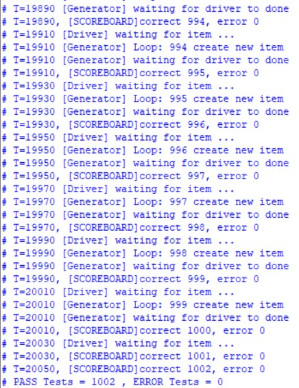

# Sequential ALU with testbench
## Table of content
- [Introduction](#introduction)
- [ALU Interface](#alu-interface)
- [ALU Package](#alu-package)
- [ALU Module](#alu-module)
- [ALU Sequence Item](#alu-sequence-item)
- [ALU Sequencer](#alu-sequencer)
- [ALU MONITOR](#alu-monitor)
- [ALU DRIVER](#alu-driver)
- [ALU SCOREBOARD](#alu-scoreboard)
- [ALU Environment](#alu-environment)
- [ALU TOP](#alu-top)
- [Simulation Results](#simulation-results)
- [Future Work](#future-work)
## Introduction


## ALU Interface

``` sv
import alu_package::*;
interface alu_interface (clk);
input clk; 
logic rst,en;
logic signed [3:0] A,B;
opcode_e opcode;
logic signed [4:0] C;
endinterface 
```
## ALU Package
``` sv
package alu_package;
 typedef enum {ADD,SUB,AND,OR}opcode_e; 
 parameter MAX_POS = 7;
 parameter MAX_NEG = -8;
 parameter ZERO = 0 ;
endpackage
```

## ALU Module
``` sv
import alu_package::*;
module ALU ( input clk,rst,en,
                 input signed [3:0] A,B,
		 input opcode_e opcode,
                 output reg signed [4:0] C );
always@(posedge clk, negedge rst)
 begin
  if(!rst)
   begin
    C<=0;
   end
  else if(en)
   begin
    case(opcode)
    ADD:
       begin
      	C<=A+B;
       end
    SUB:
       begin
      	C<=A-B;     
       end
    AND:
       begin
      	C<=A&B;      
       end
    OR:
       begin
      	C<=A|B;      
       end
     default:
       begin
      	C<=0;      
       end
    endcase
   end
 end 
endmodule
```
## ALU Sequence Item
```sv
import alu_package::*;
class seq_item;
rand logic rst,en;
  rand logic signed [3:0] A,B;
  rand opcode_e opcode;
  bit clk;
  logic signed [4:0] C;
  logic rst2;
  constraint opcode_c {
	if (opcode==ADD || opcode == SUB) {
	 A dist {MAX_POS:=30, MAX_NEG:=30, ZERO:=30 };
	 B dist {MAX_POS:=30, MAX_NEG:=30, ZERO:=30 };
	} 
	}
  constraint rst_c {
	 rst dist {0:=1, 1:=99};
	}
  constraint en_c {
	 en dist {0:=5, 1:=95};
	}
endclass
```
## ALU Sequencer
```sv
import alu_package::*;
`include "sequence_item.sv"
class alu_sequencer;
 mailbox drv_mbx;
 event drv_done;
 task run();
  for(int i=0;i<1000;i++) begin
   seq_item item = new();
   item.randomize();
   $display("T=%0t [Generator] Loop: %0d create new item",$time,i);
   drv_mbx.put(item);
   $display("T=%0t [Generator] waiting for driver to done",$time);
   @(drv_done);
  end
 endtask: run
endclass
```
## ALU MONITOR
```sv
import alu_package::*;
`include "alu_driver.sv"

class alu_monitor;
	virtual alu_interface alu_vif;
	mailbox scb_mbx;
	seq_item item;
	task run();
		$display("T=%0t [Monitor] starting ...",$time);
		forever begin
			seq_item item = new;
			item.A <= alu_vif.A;
			item.B  <= alu_vif.B;
			item.opcode <= alu_vif.opcode;
			item.en <= alu_vif.en;
                        item.rst <= alu_vif.rst;
			@(posedge alu_vif.clk);
			item.C = alu_vif.C;
			item.rst2 = alu_vif.rst;
			scb_mbx.put(item);
		end
	endtask
endclass
```

## ALU DRIVER

```sv
import alu_package::*;
`include "alu_sequencer.sv"
class alu_driver;
 virtual alu_interface alu_vif;
 mailbox drv_mbx;
 event drv_done;
 task run();
  $display("T=%0t [DRIVER] Starting....",$time);
  @(posedge alu_vif.clk)
   forever begin
    seq_item item;
    $display("T=%0t [Driver] waiting for item ...",$time);
    drv_mbx.get(item);
    alu_vif.A <= item.A;
    alu_vif.B  <= item.B;
    alu_vif.opcode <= item.opcode;
    alu_vif.en <= item.en;
    alu_vif.rst <= item.rst;
    @(posedge alu_vif.clk);
    ->drv_done;
   end
 endtask:run
endclass
```

## ALU SCOREBOARD
``` sv
import alu_package::*;
`include "alu_monitor.sv"
class alu_scoreboard;
int correct_count,error_count;
int rst_happened;
logic signed [4:0] C_expected;
mailbox scb_mbx;
function new();
begin
correct_count=0;
error_count=0;
rst_happened=0;
C_expected=0;
end
endfunction
task run();
 forever begin
  seq_item item;
  scb_mbx.get(item);
  golden_model(item);
  check_result(item);
  $display("T=%0t, [SCOREBOARD]correct %0d, error %0d",$time,correct_count,error_count);
 end
endtask
task golden_model(seq_item item);
if(!item.rst || !item.rst2)begin
C_expected=0;
end
else if(item.en)
begin
case(item.opcode)
ADD:C_expected=item.A+item.B;
SUB:C_expected=item.A-item.B;
AND:C_expected=item.A&item.B;
OR:C_expected=item.A|item.B;
endcase
end
endtask
task check_result(seq_item item);
if(item.C==C_expected)
begin
correct_count=correct_count+1;
end
else
begin
error_count=error_count+1;
$display("[SCOREBOARD] error at %0t, expected %0d, got %0d",$time,C_expected,item.C);
end
endtask
endclass
```

## ALU Environment
``` sv
import alu_package::*;
`include "alu_scoreboard.sv"

class alu_env;
	alu_sequencer g0;
	alu_driver	d0;
	alu_monitor m0;
	alu_scoreboard s0;
	mailbox scb_mbx;
	mailbox drv_mbx;
	virtual alu_interface alu_vif;
	event drv_done;

	function new();
		g0 = new;
		d0 = new;
		m0 = new;
		s0 = new;
		scb_mbx = new;
		drv_mbx = new;
	endfunction

	virtual task run;
		d0.alu_vif = alu_vif;
		m0.alu_vif = alu_vif;

		m0.scb_mbx = scb_mbx;
		s0.scb_mbx = scb_mbx;

		g0.drv_mbx = drv_mbx;
		d0.drv_mbx = drv_mbx;

		g0.drv_done = drv_done;
		d0.drv_done = drv_done;

		fork
			s0.run();
			m0.run();
			d0.run();
			g0.run();
		join_any
	endtask
endclass : alu_env
```

## ALU TOP
```sv
import alu_package::*;
`include "alu_env.sv"
module alu_top ;
	bit clk;
	alu_env e0;
	always #10 clk=~clk;
	alu_interface intr (clk);
	ALU DUT (
		.A(intr.A),
		.B(intr.B),
		.opcode(intr.opcode),
		.en(intr.en),
		.clk(clk),
		.rst(intr.rst),
		.C(intr.C)
		);
	initial begin
		clk = 0;
		intr.rst = 0;
		#20 intr.rst =1;

		e0 = new();
		e0.alu_vif = intr;
		
		e0.run();
		#30 $display ("PASS Tests = %0d , ERROR Tests = %0d",e0.s0.correct_count,e0.s0.error_count);
		$stop();
	end
endmodule : alu_top
```
## Simulation Results



## Future Work
**Converting the testbench to Class-Based Testbench using UVM**