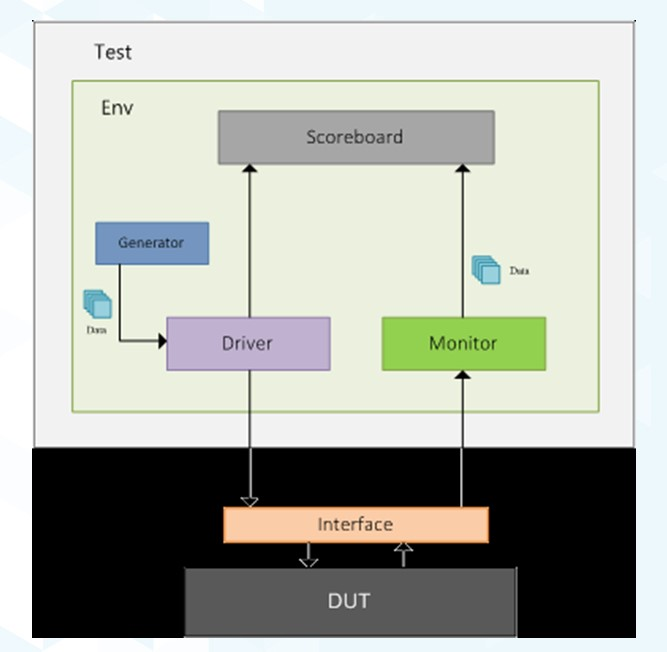

# Sequential ALU with testbench
## Table of content
- [Introduction](#introduction)
- [ALU Interface](#alu-interface)
- [ALU Package](#alu-package)
- [ALU Module](#alu-module)
- [ALU MONITOR](#alu-monitor)
- [ALU DRIVER](#alu-driver)
- [ALU SCOREBOARD](#alu-scoreboard)
- [ALU SVA](#alu-sva)
- [ALU TOP](#alu-top)
- [Future Work](#future-work)
## Introduction


## ALU Interface

``` sv
import SEQ_ALU_PACKAGE::*;
interface SEQ_ALU_INTERFACE (clk);
input clk; 
logic rst,en;
logic signed [3:0] A,B;
opcode_e opcode;
logic signed [4:0] C;

modport DUT (input clk,rst, en, A, B, opcode, output C);
modport DRIVER (input clk, output rst, en, A, B, opcode);
modport MONITOR (input clk,rst, en, A, B, opcode, C);
endinterface
```
## ALU Package
``` sv
package SEQ_ALU_PACKAGE;
 typedef enum {ADD,SUB,AND,OR}opcode_e; 
 parameter MAX_POS = 7;
 parameter MAX_NEG = -8;
 parameter ZERO = 0 ;
 class ALU;
  rand logic rst,en;
  rand logic signed [3:0] A,B;
  rand opcode_e opcode;
  bit clk;
  logic signed [4:0] C;

  constraint opcode_c {
	if (opcode==ADD || opcode == SUB) {
	 A dist {MAX_POS:=30, MAX_NEG:=30, ZERO:=30 };
	 B dist {MAX_POS:=30, MAX_NEG:=30, ZERO:=30 };
	} 
	}
  constraint rst_c {
	 rst dist {0:=1, 1:=99};
	}
 
  constraint en_c {
	 en dist {0:=5, 1:=95};
	}

covergroup ALU_GROUP @(posedge clk);
  A_CR: coverpoint A {
	 bins A_zero = {ZERO};
	 bins A_maxpos = {MAX_POS};
	 bins A_maxneg = {MAX_NEG};
         bins A_intr = {ZERO,MAX_POS,MAX_NEG};
	 bins A_others = default;
	}

  B_CR: coverpoint B {
	 bins B_zero = {ZERO};
	 bins B_maxpos = {MAX_POS};
	 bins B_maxneg = {MAX_NEG};
         bins B_intr = {ZERO,MAX_POS,MAX_NEG};
	 bins B_others = default;
	}

  opcode_CR: coverpoint opcode {
	 bins opcode_values = {ADD,SUB,AND,OR};
	}

  opcode_A_B_CR: cross B_CR,A_CR,opcode {
	 bins ADD_SUB_A_B = binsof(B_CR.B_intr)&&binsof(A_CR.A_intr) iff (opcode==ADD || opcode == SUB) ;
	 option.cross_auto_bin_max=0;
	}
endgroup
 
 function new();
  ALU_GROUP=new();
 endfunction
 endclass
endpackage
```

## ALU Module
``` sv
import SEQ_ALU_PACKAGE::*;
module SEQ_ALU ( SEQ_ALU_INTERFACE.DUT ALU_INTR );
always@(posedge ALU_INTR.clk, negedge ALU_INTR.rst)
 begin
  if(!ALU_INTR.rst)
   begin
    ALU_INTR.C<=0;
   end
  else if(ALU_INTR.en)
   begin
    case(ALU_INTR.opcode)
     ADD:
       begin
      	ALU_INTR.C<=ALU_INTR.A+ALU_INTR.B;
       end
     SUB:
       begin
      	ALU_INTR.C<=ALU_INTR.A-ALU_INTR.B;     
       end
     AND:
       begin
      	ALU_INTR.C<=ALU_INTR.A&ALU_INTR.B;      
       end
     OR:
       begin
      	ALU_INTR.C<=ALU_INTR.A|ALU_INTR.B;      
       end
     default:
       begin
      	ALU_INTR.C<=0;      
       end
    endcase
   end
 end 
endmodule
```

## ALU MONITOR
```sv
import SEQ_ALU_PACKAGE::*;
module SEQ_ALU_MONITOR (SEQ_ALU_INTERFACE.MONITOR ALU_INTR);
initial
begin
$monitor("rst %0d, en %0d, A %0d, B %0d, opcode %0d, C %0d",ALU_INTR.rst, ALU_INTR.en, ALU_INTR.A, ALU_INTR.B, ALU_INTR.opcode, ALU_INTR.C);

end
endmodule
```

## ALU DRIVER

```sv
import SEQ_ALU_PACKAGE::*;
module SEQ_ALU_driver(SEQ_ALU_INTERFACE.DRIVER ALU_INTR);
parameter T_period = 10;
ALU ALU_opj;
initial
begin
forever 
begin
#(T_period/2) 
ALU_opj.clk=ALU_INTR.clk;
end
end
initial
begin
ALU_opj=new();
assert_rst();
repeat(1000)
begin
assert(ALU_opj.randomize());
ALU_INTR.rst=ALU_opj.rst;
ALU_INTR.en=ALU_opj.en;
ALU_INTR.A=ALU_opj.A;
ALU_INTR.B=ALU_opj.B;
ALU_INTR.opcode=ALU_opj.opcode;
@(negedge ALU_INTR.clk);
end
$stop;
end
task assert_rst;
ALU_INTR.rst=0;
@(negedge ALU_INTR.clk);
@(negedge ALU_INTR.clk);
ALU_INTR.rst=1;
endtask
endmodule
```

## ALU SCOREBOARD
``` sv
import SEQ_ALU_PACKAGE::*;
module SEQ_ALU_SCOREBOARD (SEQ_ALU_INTERFACE.MONITOR ALU_INTR);
integer correct_count,error_count;
logic signed [4:0] C_expected;
initial
begin
correct_count=0;
error_count=0;
end
always @(posedge ALU_INTR.clk)
begin
golden_model();
check_result();
$display("correct %0d, error %0d",correct_count,error_count);
end
task golden_model;
if(!ALU_INTR.rst)
C_expected=0;
else if(ALU_INTR.en)
begin
case(ALU_INTR.opcode)
ADD:C_expected=ALU_INTR.A+ALU_INTR.B;
SUB:C_expected=ALU_INTR.A-ALU_INTR.B;
AND:C_expected=ALU_INTR.A&ALU_INTR.B;
OR:C_expected=ALU_INTR.A|ALU_INTR.B;
endcase
end
endtask
task check_result;
@(negedge ALU_INTR.clk)
if(ALU_INTR.C==C_expected)
begin
correct_count=correct_count+1;
end
else
begin
error_count=error_count+1;
$display("error at %0t",$time);
end
endtask
endmodule
```

## ALU SVA
``` sv
import SEQ_ALU_PACKAGE::*;
module SEQ_ALU_SVA (SEQ_ALU_INTERFACE.DUT ALU_INTR);

property p1;
@(posedge ALU_INTR.clk) (!ALU_INTR.rst) |-> (ALU_INTR.C==5'd0);
endproperty

property p2;
disable iff (!ALU_INTR.rst)
@(posedge ALU_INTR.clk) (ALU_INTR.opcode == ADD && ALU_INTR.en) |=> (ALU_INTR.C==$past(ALU_INTR.A)+$past(ALU_INTR.B));
endproperty

property p3;
disable iff (!ALU_INTR.rst)
@(posedge ALU_INTR.clk) (ALU_INTR.opcode == SUB && ALU_INTR.en) |=> (ALU_INTR.C==$past(ALU_INTR.A)-$past(ALU_INTR.B));
endproperty

property p4;
disable iff (!ALU_INTR.rst)
@(posedge ALU_INTR.clk) (ALU_INTR.opcode == AND && ALU_INTR.en) |=> (ALU_INTR.C==$past(ALU_INTR.A & ALU_INTR.B));
endproperty

property p5;
disable iff (!ALU_INTR.rst)
@(posedge ALU_INTR.clk) (ALU_INTR.opcode == OR && ALU_INTR.en) |=> (ALU_INTR.C==$past(ALU_INTR.A)|$past(ALU_INTR.B));
endproperty

property p6;
disable iff (!ALU_INTR.rst)
@(posedge ALU_INTR.clk) (!ALU_INTR.en) |=> $stable(ALU_INTR.C);
endproperty

assert_p1: assert property(p1);
cov_p1: cover property(p1);

assert_p2: assert property(p2);
cov_p2: cover property(p2);

assert_p3: assert property(p3);
cov_p3: cover property(p3);

assert_p4: assert property(p4);
cov_p4: cover property(p4);

assert_p5: assert property(p5);
cov_p5: cover property(p5);

assert_p6: assert property(p6);
cov_p6: cover property(p6);
endmodule
```

## ALU TOP
```sv
module SEQ_ALU_TOP;
bit clk;
parameter T_period = 10;
initial
begin
clk=0;
forever #(T_period/2) clk=~clk;
end

SEQ_ALU_INTERFACE ALU_INTR (clk);

SEQ_ALU DUT (ALU_INTR);

SEQ_ALU_MONITOR mon (ALU_INTR);

SEQ_ALU_driver driv (ALU_INTR);

SEQ_ALU_SCOREBOARD score (ALU_INTR);

bind SEQ_ALU SEQ_ALU_SVA sva (ALU_INTR);

endmodule
```
## Future Work
Converting the testbench to Class-Based Testbench with implementing a sequencer and a mailbox for each transaction.   
